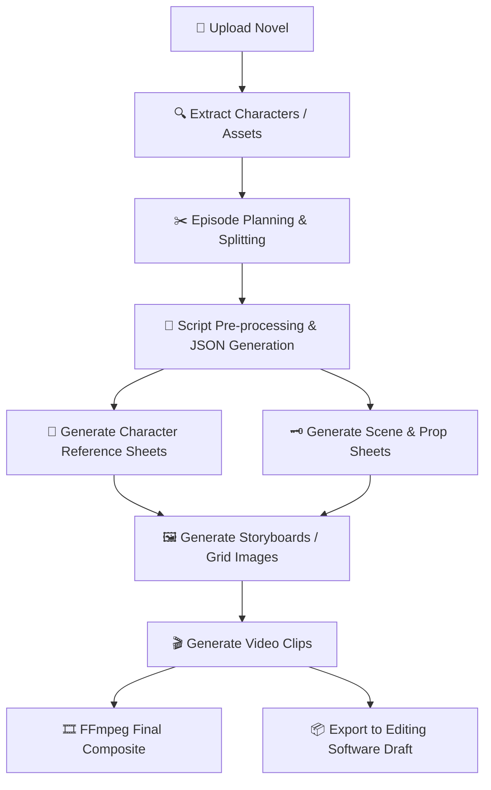
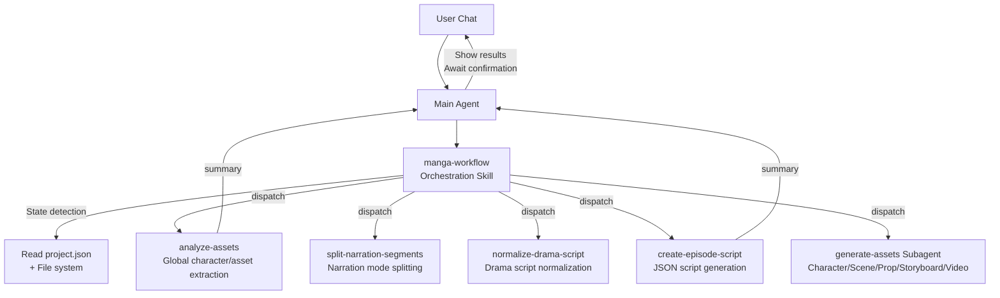

<h1 align="center">
  <br>
  <picture>
    <source media="(prefers-color-scheme: light)" srcset="frontend/public/android-chrome-maskable-512x512.png">
    <source media="(prefers-color-scheme: dark)" srcset="frontend/public/android-chrome-512x512.png">
    
  </picture>
  <br>
  ArcReel
  <br>
</h1>

<h4 align="center">Open-source AI Video Generation Platform — From novel to short video, fully AI Agent driven</h4>

<p align="center">
  <a href="https://github.com/KSaifStack/ArcReel/blob/main/LICENSE"></a>
  <a href="https://github.com/KSaifStack/ArcReel"></a>
</p>

<p align="center">
  
  
  
  
  
  
  
  
</p>

<p align="center">
  
</p>

---

## Core Features

<table>
<tr>
<td width="20%" align="center">
<h3>🤖 AI Agent Workflow</h3>
Built on <strong>Claude Agent SDK</strong>, orchestrates Skill + focused Subagent multi-agent collaboration to automate the entire pipeline from script writing to video synthesis.
</td>
<td width="20%" align="center">
<h3>🎨 Multi-Provider Image Generation</h3>
<strong>Gemini</strong>, <strong>Grok</strong>, <strong>OpenAI</strong>, <strong>Vidu</strong> and custom providers. Character reference sheets ensure visual consistency across all scenes.
</td>
<td width="20%" align="center">
<h3>🎬 Multi-Provider Video Generation</h3>
<strong>Veo 3.1</strong>, <strong>Seedance</strong>, <strong>Grok</strong>, <strong>Sora 2</strong>, <strong>Vidu Q3</strong> and custom providers. Switchable globally or per-project.
</td>
<td width="20%" align="center">
<h3>⚡ Async Task Queue</h3>
RPM rate limiting with separate Image/Video concurrency channels, lease-based scheduling, and checkpoint resume support.
</td>
<td width="20%" align="center">
<h3>🖥️ Visual Workspace</h3>
Web UI for project management, asset preview, version rollback, real-time SSE task tracking, and built-in AI assistant.
</td>
</tr>
</table>

## Workflow



---

## Quick Start

### Windows (One-Click Launch)

> **Requirements**: Python 3.12+, Node.js 18+, `uv`, `pnpm`

**Step 1 — Install Prerequisites** (open PowerShell as Administrator):

```powershell
# Install uv (Python package manager)
powershell -ExecutionPolicy ByPass -c "irm https://astral.sh/uv/install.ps1 | iex"

# Install pnpm (via npm, which comes with Node.js)
npm install -g pnpm
```

**Step 2 — Clone & Launch:**

```bash
git clone https://github.com/KSaifStack/ArcReel.git
cd ArcReel
```

Then double-click `start.bat`. It will automatically:
1. Install backend Python dependencies (`uv sync`)
2. Start the backend server on `http://localhost:1241`
3. Install frontend Node dependencies (`pnpm install`)
4. Start the frontend dev server on `http://localhost:5173`
5. Open your browser

> **Note**: On first launch, a random password is auto-generated for you and saved to `.env`. Your login is `admin` / `<password from .env>`.
> To disable the login screen for local use, add `AUTH_ENABLED=false` to your `.env` file.

### Docker (Linux / macOS / WSL2 — Recommended for Production)

```bash
git clone https://github.com/KSaifStack/ArcReel.git
cd ArcReel/deploy
cp .env.example .env
docker compose up -d
# Access at http://localhost:1241
```

For production with PostgreSQL:

```bash
cd ArcReel/deploy/production
cp .env.example .env   # Set POSTGRES_PASSWORD
docker compose up -d
```

---

## Initial Configuration

After first launch, go to the **Settings page** (`/settings`) and configure:

1. **ArcReel Agent** — Add your Anthropic API key (or a compatible provider) to power the AI assistant.
2. **Image / Video / Text AI** — Configure at least one provider API key (Gemini / Grok / OpenAI / Vidu) to enable media generation.

> 📖 See [DEPLOYMENT.md](DEPLOYMENT.md) for a full step-by-step setup guide.

---

## Features

- **Full production pipeline** — Novel → Script → Character design → Storyboards → Video clips → Final cut, fully orchestrated
- **Multi-agent architecture** — Orchestration Skill detects project state and dispatches focused Subagents; each Subagent returns a summary to the main Agent
- **Sandboxed Agent runtime** — Agent tool calls run inside a `bwrap` sandbox on Linux/macOS (automatically degrades gracefully on Windows)
- **Multi-provider support** — Image/Video/Text generation supports Gemini, Grok, OpenAI, Vidu as built-in providers; switchable globally or per-project
- **Custom providers** — Connect any OpenAI-compatible or Google-compatible API (Ollama, vLLM, third-party relays), with automatic model discovery
- **Two content modes** — Narration mode (splits by reading pace) and Drama/Animation mode (organized by scene/dialogue)
- **Three video generation modes** — Storyboard-to-video (default) / Grid-to-video (multi-shot grid) / Reference-to-video (uses asset sheets directly, skips storyboarding)
- **Progressive episode planning** — Human-in-the-loop splitting of long novels: Agent suggests breakpoints → User confirms → Physical file splitting
- **Character consistency** — AI generates character reference sheets first; all subsequent storyboards and videos reference these designs
- **Asset tracking** — Key props and scenes are captured as assets, ensuring visual coherence across shots
- **Version history** — Every re-generation automatically saves prior versions with one-click rollback
- **Cost tracking** — Full cost calculation across all image/video/text providers with per-currency tracking
- **Cost estimation** — Pre-generation cost estimates at project/episode/shot level
- **Project import/export** — Archive entire projects for backup and migration

---

## Provider Support

### Image Providers

| Provider | Models | Capabilities |
|----------|--------|--------------|
| **Gemini** (Google) | Imagen 3, Imagen 3 Fast | Text-to-image, Image-to-image (multi-reference) |
| **Grok** (xAI) | Aurora, Aurora Pro | Text-to-image, Image-to-image |
| **OpenAI** | GPT Image 2, GPT Image 1 Mini | Text-to-image, Image-to-image (multi-reference) |
| **Vidu** | Vidu Q2 Image, Q1 Image | Text-to-image, Image-to-image |

### Video Providers

| Provider | Models | Duration (s) |
|----------|--------|-------------|
| **Gemini** (Google) | Veo 3.1, Veo 3.1 Fast, Veo 3.1 Lite | 4 / 6 / 8 |
| **Grok** (xAI) | Grok Video | 1–15 |
| **OpenAI** | Sora 2, Sora 2 Pro | 4 / 8 / 12 |
| **Vidu** | Vidu Q3 Turbo, Q3 Pro, Q3 Reference, 2.0 | 1–16 |

### Text Providers

| Provider | Models |
|----------|--------|
| **Gemini** (Google) | Gemini 2.5 Pro, Flash, Flash Lite |
| **Grok** (xAI) | Grok 3, Grok 3 Fast |
| **OpenAI** | GPT-4o, GPT-4o Mini |

### Custom Providers

Connect any **OpenAI-compatible** or **Google-compatible** API:
- Add the provider in Settings → fill in Base URL and API Key
- Models are auto-discovered via `/v1/models`
- Full feature parity with built-in providers: global/project switching, cost tracking, version management

---

## AI Assistant Architecture

ArcReel's AI assistant is built on the Claude Agent SDK using an **Orchestration Skill + Focused Subagent** multi-agent architecture:



**Core Design Principles**:

- **Orchestration Skill (`manga-workflow`)** — Detects project stage automatically (asset design / episode planning / preprocessing / script generation / asset generation), dispatches corresponding Subagents, supports resuming from any stage
- **Focused Subagents** — Each Subagent completes one task and returns. Heavy context (like the raw novel text) stays inside the Subagent; the main Agent only receives a condensed summary
- **Skill vs Subagent boundary** — Skills handle deterministic script execution (API calls, file generation); Subagents handle tasks requiring reasoning and analysis (character extraction, script normalization)
- **Inter-stage confirmation** — After each Subagent returns, the main Agent shows the user a results summary and waits for confirmation before advancing

---

## Tech Stack

| Layer | Technology |
|-------|------------|
| **Frontend** | React 19, TypeScript, Tailwind CSS 4, wouter, zustand, Vite |
| **Backend** | FastAPI, Python 3.12+, uvicorn, Pydantic 2 |
| **AI Agent** | Claude Agent SDK (Skill + Subagent multi-agent architecture) |
| **Image Generation** | Gemini (`google-genai`), Grok (`xai-sdk`), OpenAI (`openai`), Vidu (`httpx`) |
| **Video Generation** | Gemini Veo 3.1, Grok Video, OpenAI Sora 2, Vidu Q3 |
| **Text Generation** | Gemini, Grok, OpenAI, Instructor (structured output fallback) |
| **Media Processing** | FFmpeg, Pillow |
| **ORM & Database** | SQLAlchemy 2.0 (async), Alembic, aiosqlite, asyncpg — SQLite (default) / PostgreSQL (production) |
| **Auth** | JWT (`pyjwt`), API Key (SHA-256 hash), Argon2 password hashing (`pwdlib`) |
| **Deployment** | Docker, Docker Compose (`deploy/` default, `deploy/production/` with PostgreSQL) |

---

## Windows Compatibility Notes

Windows is fully supported for local development. A few things to be aware of:

- The `bwrap` sandbox is **not available on Windows**. The Agent runtime automatically falls back to a code whitelist for Bash tool calls. For production, WSL2 or Docker is strongly recommended.
- The backend must be launched with `--loop asyncio` (already included in `start.bat`) to use `ProactorEventLoop`, which is required for the Claude Agent SDK to spawn subprocess workers.
- Long file paths (>260 chars) may require enabling `LongPathsEnabled=1` in Windows 10 1607+.

---

## Documentation

- 📖 [DEPLOYMENT.md](DEPLOYMENT.md) — Full setup guide including Windows, Docker, and manual install
- 📦 See `docs/` for provider-specific pricing and configuration guides

---

## Contributing

Contributions, bug reports, and feature requests are welcome! Please read [CONTRIBUTING.md](CONTRIBUTING.md) for local development setup, testing, and code standards.

After cloning, run once:

```bash
uv run pre-commit install
```

This installs pre-commit hooks (ruff check + format, frontend eslint) to catch issues before they reach CI.

---

## License

[AGPL-3.0](LICENSE)

---

<p align="center">
  If you find this project useful, please give it a ⭐ Star!
</p>